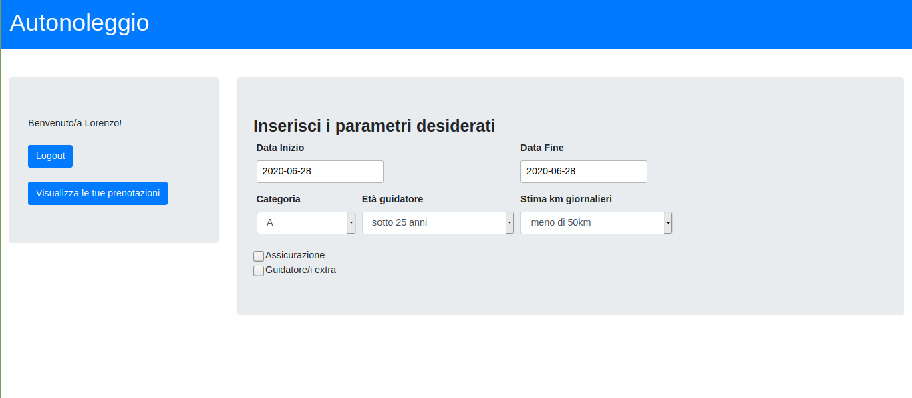

# Exam #1: "Noleggio veicoli"
## Student: s280099 APPENDINI LORENZO

## React client application routes

- Route `/guest`: pagina principale per chi non abbia ancora effettuato il login, contiene una tabella che mostra il catalogo di auto fornite e dei filtri
                  per modificare la visualizzazione di quest'ultima; è presente inoltre un form per effettuare il login
- Route `/`: pagina principale per gli utenti che abbiano effettuato il login correttamente, contiene il configuratore interattivo di noleggio e
             dei bottoni che consentono di effettuare il logout e di visualizzare la pagina dei propri noleggi
- Route `/rentals`: pagina che contiene una tabella con i noleggi effettuati (o futuri) dell'utente loggato

## REST API server

- POST `/api/login` 
  - request body: username,password
  - response body: username,name
  - aggiunge il token jwt necessario per eseguire tutte le ulteriori operazioni
- POST `/api/logout`
  - request body: -
  - response body: -
  - rimuove il token jwt
- GET `/api/csrf-token`
  - request body: -
  - response body: token csrf
- GET `/api/user`
  - request body: -
  - response body: username,name
- GET `/api/cars`
  - request parameters: -
  - response body: lista di tutte le auto presenti nel database
- GET `/api/rentals/:params`
  - request parameters: categoria,stima km giornalieri,età,guidatore addizionale,assicurazione,data d'inizio, data di fine
  - request body content: -
  - response body content: numero di auto disponibili,prezzo,id di un'auto disponibile (carID)
- POST `/api/payment`
  - request body: prezzo,nominativi,numero carta,CVV
  - response body: -
  - effettua un controllo di presenza sui campi inviati e in caso affermativo conclude la comunicazione correttamente
- GET `/api/rentals`
  - request body: -
  - response body: lista di tutti i noleggi (conclusi,attuali o futuri) effettuati dall'utente
- POST `/api/rentals/add`
  - request body: carID,data d'inizio,data di fine
  - request body: -
  - effettua un controllo di presenza sui campi inviati e in caso affermativo inoltra al database
- DELETE `/api/rentals/:rentalID`
  - request parameters: id del noleggio da rimuovere
  - response parameters: -

## Server database

- Table `users` - contiene username,password (hash),name
- Table `cars` - contiene carID,brand,model,category
- Table `rentals` - contiene rentalID,carID,data d'inizio,data di fine

## Main React Components

- `CarCatalog` (in `GeneralComp.js`): componente con una tabella che mostra per ogni automobile presente nel db 
   i suoi parametri di interesse (marca,modello e categoria)
- `CarFilters` (in `GeneralComp.js`): componente con due gruppi di checkbox, uno per le marche (ottenute dinamicamente dall'elenco completo di auto) e uno per le 
   categorie (statico), che permettono di aggiornare il contenuto di CarCatalog in base alle combinazioni selezionate
- `UserRentals` (in `GeneralComp.js`): componente con una tabella che mostra le prenotazioni/noleggi dell'utente attualmente autenticato, inoltre permette di
   eliminare i noleggi non ancora iniziato alla data odierna
- `ConfigForm` (in `ConfigComp.js`): componente con un gruppo di form per selezionare le varie opzioni che andranno a definire la nuova prenotazione, andando poi 
   a mostrare il risultato in un componente secondario,il quale eventualmente inoltrerà al `PaymentForm` 
- `PaymentForm` (in `ConfigComp.js`): componente con un gruppo di form da compilare con i dati di pagamento che andrà (in caso di dati validi) ad effettuare 
   il processo di aggiunta della nuova prenotazione (previo controllo 'fittizio' del pagamento)
- `Login` (in `LogicComp.js`): componente che si occupa della procedura di autenticazione (e relativo reindirizzamento alla pagina per clienti)
- `Logout` (in `LoginComp.js`): componente che si occupa della procedura di logout (e relativo reindirizzamento alla pagina iniziale)

## Screenshot

## Test users

* u1@p.it, ddd (cliente frequente)
* u2@p.it, eee
* u3@p.it, aaa (cliente frequente)
* u4@p.it, bbb
* u5@p.it, ccc 
